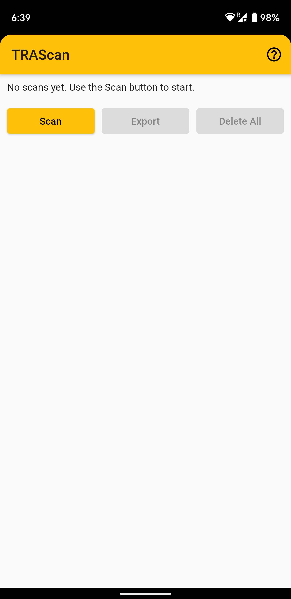
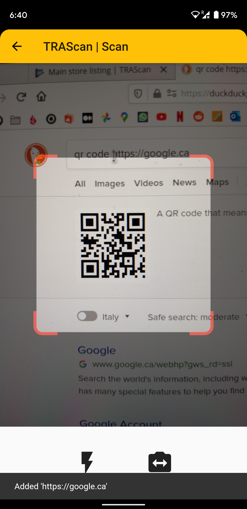
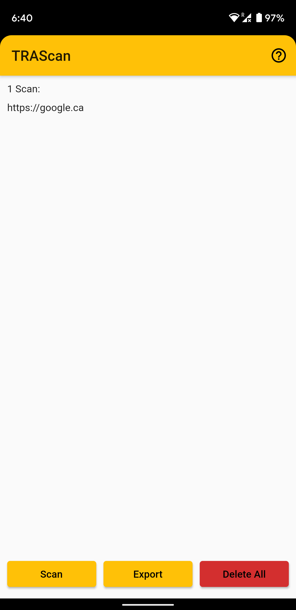
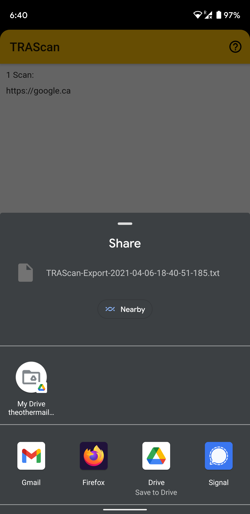

# TRAScan

Scan QR codes in quick succession.

Designed for use with TRA receipts that link to pages on https://verify.tra.go.tz.

> Please excuse the funny sound effects; this App has a very specific use case and has been developed mainly for use by my dad.

## Usage

- Press the scan button to scan QR codes and add them to the scans list. Duplicate entries are skipped automatically.

- After scanning all codes, go back to the main screen to view them.

- Use the Export button to share the list to other apps.

- You may want to use the Export feature to email the list to yourself. Be sure to do this BEFORE exiting the app, as the in-app list is not stored permanently.

- To process the file (extract TRA receipt data), use the [TRAExtract](https://github.com/ImranR98/TRAExtract) PC app.

## Screenshots

| Home Page - No Scans                                         | Scan Page                                                    | Home Page - One Scan                                         |
| ------------------------------------------------------------ | ------------------------------------------------------------ | ------------------------------------------------------------ |
|  |      |  |
| **Share Scans**                                              | **Deletion Prompt**                                          | **Home Page - Deleted Scans**                                |
|  |  |  |
